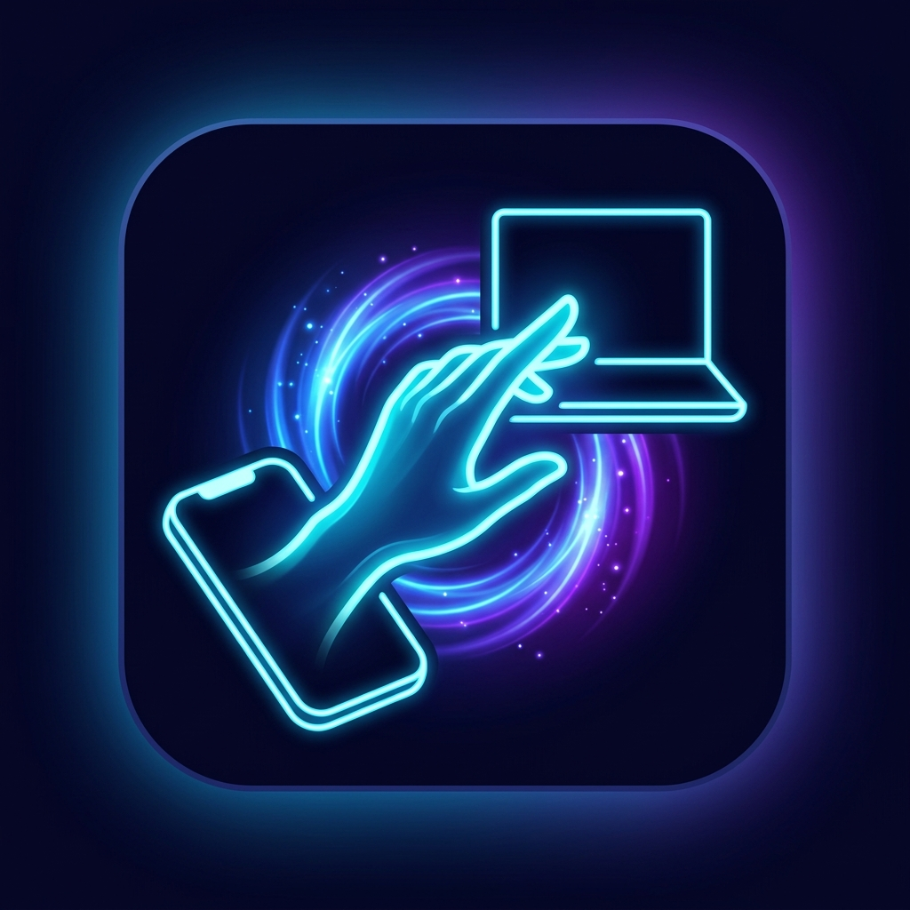

# DreamGesture (GestureShare)

<div align="center">



### Replicating & Improving AI Hand Gesture File Sharing Across Devices

**No accounts. No pairing. No cloud. Just gesture.**

[](LICENSE)
[](#)

</div>

---

## 🌟 Overview

**DreamGesture (GestureShare)** is an open-source cross-platform system that enables users to transfer files, screenshots, and media between phones and computers using intuitive hand gestures. Inspired by Huawei's Air Gesture system, DreamGesture brings real-time 60FPS hand tracking, direction estimation, and zero-touch encrypted local transfers to all devices.

---

## 📁 Repository Projects

This repository contains two primary modules:

1. **[GestureShare](./GestureShare)** — Production-grade native Android application built with Kotlin, Jetpack Compose, Clean Architecture, Hilt, CameraX, and MediaPipe AI.
2. **[GestureShare-unified](./GestureShare-unified)** — Multi-platform engine and application supporting **Windows**, **macOS**, **Linux**, and **Android** using Tauri, Rust protocol core (`protocol-rs`), and cross-platform gesture detection.

---

## 🚀 How It Works

```
Screenshot / File Selected → AI Camera Detects Hand Gesture → Direction Estimation →
Target Device Discovery → Encrypted Direct Transfer → 60FPS Smooth Animation
```

### Supported Gestures & Actions

| Gesture | Action | Description |
|---------|--------|-------------|
| 🖐️ **Open Palm** | Open Share Menu | Activates target selection mode |
| ✊ **Grab & Throw** | Share Content | Sends selected item in the pointed direction |
| 👈 / 👉 **Point** | Target Selection | Locks onto nearby receiving device |
| 👊 **Push** | Confirm Transfer | Executes direct peer-to-peer sending |
| ✋ **Pull** | Cancel | Aborts current transfer |
| 👍 **Thumbs Up** | Quick Accept | Accepts incoming transfer request |

---

## 🛠️ Security & Privacy

- **Local-Only P2P**: Direct transfer using Wi-Fi Direct, BLE, and local socket channels. No servers or cloud involved.
- **End-to-End Encryption**: AES-256-GCM encryption with ECDH key exchange.
- **Privacy-First Vision Engine**: Hand landmark tracking happens 100% on-device; camera frames are processed in memory and never stored or uploaded.

---

## 💻 Quick Start & Build Guide

### Android App (`GestureShare`)
```bash
cd GestureShare
./gradlew assembleDebug
```

### Cross-Platform Unified Engine (`GestureShare-unified`)
```bash
cd GestureShare-unified
# Build Rust Core Protocol
cd core/protocol-rs && cargo build --release
```

---

## 📄 Documentation

- [Android Architecture Guide](./GestureShare/docs/ARCHITECTURE.md)
- [Developer & Setup Guide](./GestureShare/docs/DEVELOPER_GUIDE.md)
- [Security & Threat Model](./GestureShare/docs/SECURITY.md)
- [Performance & Benchmark](./GestureShare/docs/PERFORMANCE_BENCHMARK.md)

---

## 📄 License

Distributed under the Apache 2.0 License. See `LICENSE` for details.
